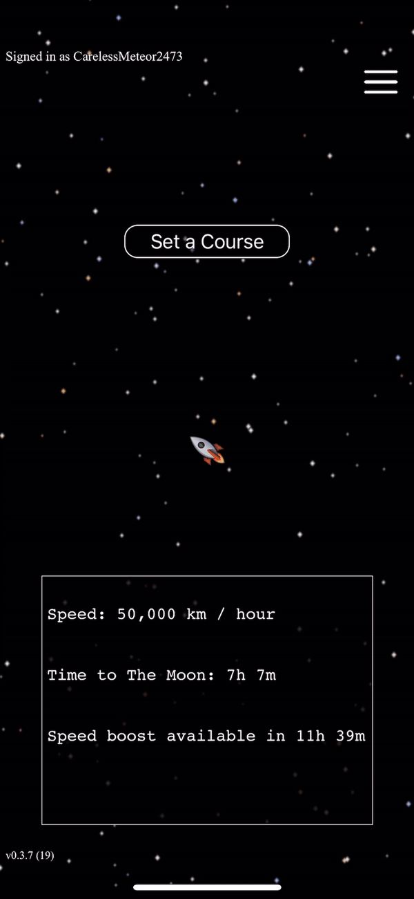

# Space-Game

Space game is a multiplayer game where players travel to planets, moons, stars, etc in real time (while the app is not open). The sizes and distances between
objects are realistic and to scale. Players start on Earth and choose a destination with a starting speed of 50,000 km / hour.
Players are able to double their speed when opening the app after a period of 12 hours,
effectively providing exponential growth.

## First-time player sequence:

The relative position of objects to Earth and eachother is realistic as well (updated on a daily basis, z-axis is flattened)

When players land on an object, they collect a flag with the planet depicted as well as a number indicating if they were the first to land there or how many people
landed there before them:

